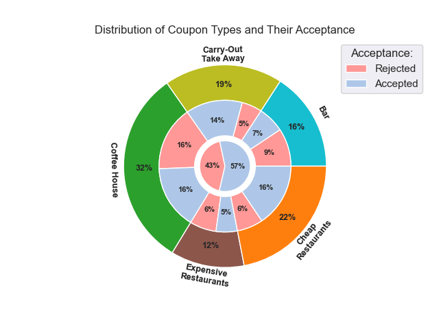
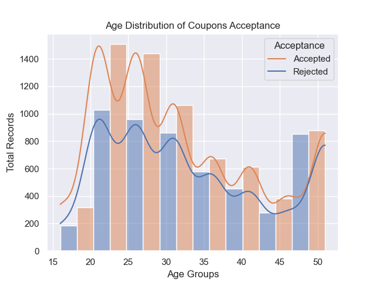
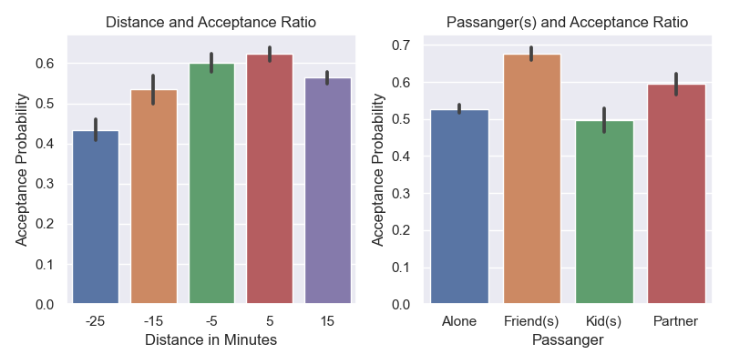
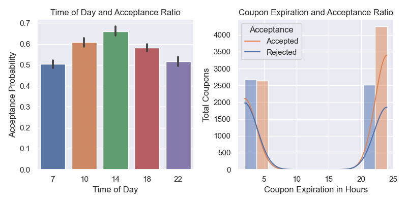

# Will a Customer Accept the Coupon?

The data for this practical project is from the UCI Machine Learning collected by an Amazon Mechanical Turk's survey. The goal is to find insights about the data through exploratory data analysis (EDA), so it can be used to train machine learning (ML) models to predict the outcome. The original data has 12684 rows in 26 columns.

## Data Cleaning

Upon investigation, it is clear that column "car" has the most missing values with 12576 rows. Simply dropping missing values will significantly deteriorate the data quality, therefore the missing values in this column has filled with the "Unknown" keyword.

Other missing values reside in following columns: **Bar** = 107, **CoffeeHouse** = 217, **CarryAway** = 151, **RestaurantLessThan20** = 130, and **Restaurant20To50** = 189. Since these are negligible compared to total records, it was decided to drop the rows with missing values for the purpose of this EDA report. However, a more robust procedure for managing missing values, like using mean values, is suggested for later model trainings.

Lastly, most of the columns are categorical, or, have special characters. Age, time, income, temperature, distance, expiration, and number of visits for each venue have been changed and converted to appropriate numeric or time values. For the venue visits, the lower-bound has been used to ease later queries, i.e. 1\~3 visits is stored as 1, and 4\~8 is stored as 4.

## Was the Program Successful?

The program has been slightly successful with 57% of the drivers accepted the coupons in comparison to 43% who ignored them. As seen in the chart below, however, the offered coupons distribution is not the same in all categories, and while the most acceptance is 16% in both coffee shops and cheap restaurants, there were significantly more coffee shop coupons shown to the customers. The most successful categories, therefore, are carry-out and cheap restaurants, and the worst is bar coupons with the most rejection rate. To find reasons and solutions to improve the program, we need to dig deeper into the data.

## Age Distribution

Since this program relies on cars to present the coupons, age distribution is not normal and right skewed and positive for the main reason that people can get their driving licenses around the age of 16. Also, the data is consolidated into single categories for below 21 years old and 50 plus people which sacrifices the resolution, but more importantly, any analysis on the age column needs to follow strict statistical rules.

As seen on the chart below, best coupons turnover is associated with age groups of 21, 26, 41, and 46. Above 50 drivers have almost 50% rejection rate which makes sense since they are probably not technologically savvy, and below 21 numbers are low because there are probably less drivers in that group. We need to dig more into the data to find out where each age group has spent their money on. Lastly, the valleys on the KDE charts below show that the age data is not continuous.

## Distance, Passenger, and Acceptance

As seen in below chart, drivers do not mind to take a slight detour of 5 min (shown as -5) to use the coupon, however, opposite directions of equal distances have lower acceptance rate.

Also, it is notable that drivers that had friends or partner with them in the car were more likely to accept the coupons than being alone or with kids.

 

## Time of Day, Expiration, and Acceptance

We see in the following chart that time of day has an impact on acceptance ratio. Particularly, 2PM has the best turnover followed by 10AM and 6PM, which makes sense since people are out for lunch for the 2PM slot. We can also observe that expiration of 2 hours has the most rejection rate than 24 hours.

# Bar Coupons

This category is the worst category in this program with acceptance rate of 0.411. As noted in the accompanied Jupyter notebook, the data analysis shows that acceptance rate can increase by a factor of two, if:
1. The drivers go to bars more than 3 times a month.
2. They are over the age of 25.
3. They have no kids in the car.

# Coffee House Coupons

The probability of customers accepting coffee shop coupons are actually less than rejecting them at (0.496). To improve the acceptance ratio, we need to understand the target audience for this category of coupons. The probability significantly increases by gradually following below measures:
1. Limiting the age between 20 and 30 (0.516).
2. Age range and not travelling alone (0.613).
3. Above, and distance less than 5 min (0.623).
4. Above plus income between $25,000 and $50,000 (0.707).
5. Above, and expiration more than 2 hours and at 10AM or 6PM (0.867).

As demonstrated here, we can increase the acceptance rate by 75% if we adjust the target audience of these coupons.

# Carry-Out and Take-Away Coupons

Carry out coupons are already the best category in terms of acceptance probability at 0.738, but there are still measures we can take to improve the acceptance even further:
1. Drivers who travel with friends (0.76).
2. Drivers who are with friends and out at 6PM (0.913).
3. Above drivers making $25,000 or more (0.941).

# Cheap Restaurants (<$20) Coupons

Cheap restaurants are second best categories in this program at 0.71. Exploring the data revealed many interesting facts about customers who frequent this venue:
1. Drivers respond better to coupons with expiration date over 2 hours (0.836).
2. First condition and travelling with friends (0.917).
3. Above and at 6PM (0.929).
4. Everything in addition to income greater than $25,000 and less or equal to $50,000 (0.972).

These drivers seem to be very sensitive to the expiration date of the coupon, so they don't take limited time coupons too seriously.

# Expensive Restaurants ($20-$50) Coupons

Expensive restaurants are the underperforming category of this program after bar coupons, so we need to find ways to improve the acceptance rate (0.446). Here are some observations about the drivers:
1. Drivers respond better with longer expiration coupons (0.524).
2. Also, they are more likely to accept if they are travelling with a partner (0.711).
3. Above conditions and if they make $80,000 or more per year (0.762).
4. Also, if the temperatures are above 50 degrees (0.8).

Interestingly, while in other categories travelling with friends increased the chance of acceptance, here we see that travelling with a partner actually has better impact.

# Conclusion

While each category of coupons has its own target audience that can be tweaked to increase the acceptance rate, we can see that having a limited expiration time on coupons has adverse outcome. Therefore, it is suggested that the 2-hour coupons are dropped from the program. 

